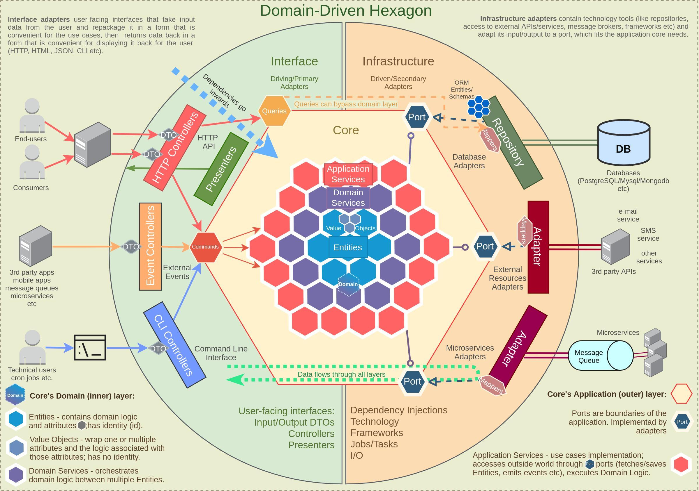

# Golang template

This template contains a list of questions that you can use to interview a Golang developer.

# TODO

1. Look at the architecture diagram and implement an application (no complications).
   
2. Application restrictions:
    - [ ] Use Golang :)
    - [ ] Use Dummy storage (you can use any storage you want)
    - [ ] Use layer separation
    - [ ] Use DDD [optional]
    - [ ] Use dependency injection (you can use any DI you want) [optional]
    - [ ] Use mapping to DTO (you can use any mapping you want) [optional]
    - [ ] Use generics [optional]
    - [ ] Use validation [optional]
    - [ ] Use error handling [optional]
    - [ ] Use configuration [optional]
    - [ ] Use logging [optional]
    - [ ] Use tests [optional]
3. Application should be able to:
    - [ ] Create a new user
    - [ ] Get a user by ID
    - [ ] Get a user by email
    - [ ] Delete a user
    - [ ] List users
